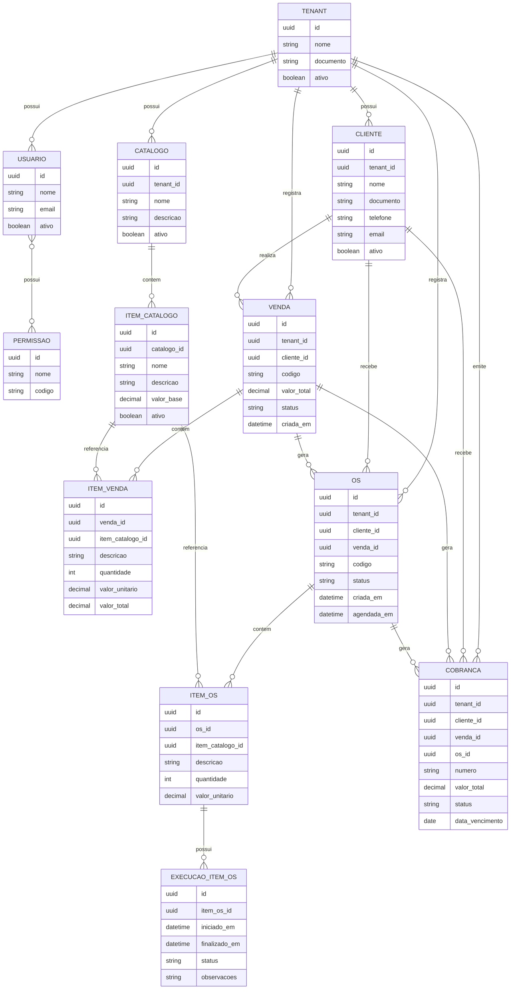

# Diagrama de Classes

## Visão Geral

Este documento descreve as principais entidades do sistema e seus respectivos atributos.

As entidades atualmente mapeadas são:

- [x] TENANT
- [ ] USUARIO
- [ ] PERMISSAO
- [x] CLIENTE
- [x] CATALOGO
- [x] ITEM_CATALOGO
- [ ] VENDA
- [ ] ITEM_VENDA
- [ ] OS
- [ ] ITEM_OS
- [ ] EXECUCAO_ITEM_OS
- [ ] COBRANCA

---

## TENANT

| Campo | Tipo | Descrição |
| --- | --- | --- |
| id | UUID | Identificador único do tenant |
| nomeFantasia | String | Nome fantasia da empresa |
| razaoSocial | String | Razão social da empresa |
| tipoDocumento | String | Tipo do documento (`CPF` ou `CNPJ`) |
| documento | String | Documento da empresa |
| inscricaoEstadual | String? | Inscrição estadual |
| email | String | Email principal |
| telefone | String | Telefone principal |
| ativo | Boolean | Indica se o tenant está ativo |
| cep | String | CEP do endereço |
| estado | String | Estado |
| cidade | String | Cidade |
| bairro | String | Bairro |
| rua | String | Rua |
| numero | String | Número do endereço |
| criadoEm | LocalDateTime | Data de criação do registro |
| atualizadoEm | LocalDateTime | Data da última atualização |

## CLIENTE

| Campo | Tipo | Descrição |
| --- | --- | --- |
| id | UUID | Identificador único do cliente |
| tenantId | UUID | Tenant ao qual o cliente pertence |
| nomeFantasia | String | Nome fantasia do cliente |
| razaoSocial | String | Razão social do cliente |
| tipoDocumento | String | Tipo do documento (`CPF` ou `CNPJ`) |
| documento | String | Documento do cliente |
| inscricaoEstadual | String? | Inscrição estadual |
| email | String | Email principal |
| telefone | String | Telefone principal |
| nomeContato | String? | Nome do contato principal |
| ativo | Boolean | Indica se o cliente está ativo |
| cep | String | CEP do endereço |
| estado | String | Estado |
| cidade | String | Cidade |
| bairro | String | Bairro |
| rua | String | Rua |
| numero | String | Número do endereço |
| complemento | String? | Complemento do endereço |
| criadoEm | LocalDateTime | Data de criação do registro |
| atualizadoEm | LocalDateTime | Data da última atualização |

## Catalogo

| Campo | Tipo | Descrição |
| --- | --- | --- |
| id | UUID | Identificador único do catálogo |
| tenantId | UUID | Tenant proprietário do catálogo |
| nome | String | Nome do catálogo |
| descricao | String? | Descrição do catálogo |
| ativo | Boolean | Indica se o catálogo está ativo |
| criadoEm | LocalDateTime | Data de criação do registro |
| atualizadoEm | LocalDateTime | Data da última atualização |

## ItemCatalogo

| Campo | Tipo | Descrição |
| --- | --- | --- |
| id | UUID | Identificador único do item do catálogo |
| catalogoId | UUID | Catálogo ao qual o item pertence |
| codigo | String | Código interno do item |
| nome | String | Nome do serviço/produto |
| descricao | String? | Descrição detalhada do item |
| valorBase | BigDecimal | Valor padrão do item |
| tempoEstimadoHoras | Integer? | Tempo estimado de execução em horas |
| ativo | Boolean | Indica se o item está ativo |
| criadoEm | LocalDateTime | Data de criação do registro |
| atualizadoEm | LocalDateTime | Data da última atualização |

##

---

## Diagrama ER

